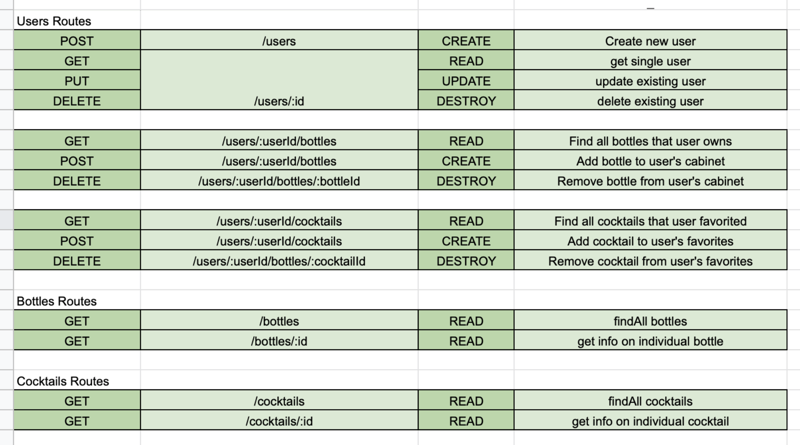

# The Cocktail Cabinet #

The cocktail cabinet is an app that allows users to log in and build their digital liquor cabinet. Update your profile with the quantity of bottles you have in your physical liquor cabinet. Browse through all sorts of cocktails, sorted by category or by bottle. If you find a recipe that sounds good, save it to your profile. You can log out and log back in anytime you'd like to look through your liquor cabinet or access your favorite recipes!

### MVP goals ###

Have a sign up page for new users to join the site.\
Have a login page for user to access site.\
Look through a page of liquor bottles with a button to add to your collection.\
Be able to look through collection, updating or deleting bottles.\
Add cocktails to your saved recipes, with the ability to view and delete them.

### Stretch goals ###

Add a page to view all cocktails, regardless of what's in user's liquor cabinet.\
Add ability to view recipes, regardless of sign-in.\
Access list of cocktails based on what's available in your bottle collection.\
Make it possible for a user to rate cocktails.\
Be able to see all users ratings aggregated on individual cocktails.\
Comment on cocktails and see other users comments.\
Add styling to have liquor bottles sitting on shelf.

### User stories ###

* As a user, I want to sign up for an account so that I can begin using the sites features and saving my information
* As a user, I want to login to the site so that I can access my information that I have saved previously.
* As a user, I want to look through a page of liquor bottles that I can add to my collection so I can keep track of what I have on hand.
* As a user, I want to browse my collection of liquor bottles so that I can add, subtract, or delete bottles from my list.
* As a user, I want to be able to look at a list my favorite recipes so that I can access them individually or delete them.
* As a user, I want to be able to logout so that my information is saved in the database, but is not accessible by other users.

### Explanation of the APIs you plan to use ###

I am planning on using The Cocktail DB, which is a free, crowd-sourced API full of information about cocktails and their ingredients.

### Daily sprints ###

* Monday
  * Finish Readme
  * Wireframe App
  * Plan db ERD
  * Plan routes chart
  * Begin setting up npm, sequelize, and express.

* Tuesday
  * Create and test db models.
  * Stub out all routes based on RESTful chart.
  * Build out routes in specific controllers.
  * Create all necessary folders and files in project.

* Wednesday
  * Finish all routes and check connection to db.
  * Build out views; layout, and specific routes.

* Thursday
  * Finish and clean up all views and routes.
  * Finish MVP.

* Friday
  * Style views.
  * Stretch goals.

* Saturday
  * Stretch Goals.

* Sunday
  * Stretch Goals.

### Wireframes ###

### Database ERDs ###

### RESTful routing chart for your app ###
